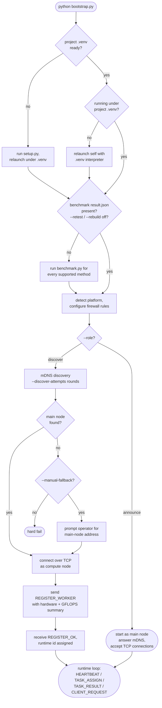

# superweb-cluster

## Status

`superweb-cluster` has completed Sprint 1 through Sprint 4. Sprint 4 is the
final sprint of this submission cycle; remaining work has been captured under
[Future Work](#future-work) rather than carried into another sprint.

Sprint 1 established the baseline runtime: bootstrap, discovery, registration,
protobuf messaging, heartbeat, and the first end-to-end distributed compute
path.

Sprint 2 hardened that baseline around the first production method, expanded
hardware benchmark coverage, and reshaped the repository so new compute methods
can be added without collapsing everything back into one runtime path.

Sprint 3 turned the cluster into a multi-method platform, brought `conv2d`
fully online end-to-end (including a separate TCP data plane for large
artifacts), and introduced the first WinUI3 and iOS frontends so the cluster is
no longer terminal-only.

Sprint 4 hardened the production path for release: worker-level fault
tolerance, per-slice timing diagnostics, multi-mode `conv2d` client response
shapes, memmap-driven aggregation, and a third compute method (`gemm`)
end-to-end. The OS-driven adaptive capacity signal and the per-platform
frontend / backend release work were partially scoped and have been deferred
to post-Sprint-4 follow-up — see [Future Work](#future-work) below.

## Features

| Capability | Description |
|---|---|
| **Auto-Discovery** | Zero-configuration LAN discovery via mDNS, with `discover` and `announce` bootstrap roles |
| **Method-Aware Benchmarking** | Each node benchmarks supported methods locally and reports per-method GFLOPS summaries during registration |
| **GFLOPS-Aware Scheduling** | The main node tracks benchmark-derived processor inventories and partitions work proportionally to measured throughput |
| **Worker-Level Failover** | When a worker dies mid-slice, its row/output-channel range is re-partitioned across surviving workers proportional to their original throughput; the in-flight client request still completes |
| **Multi-Mode Client Response** | Conv2d clients can opt into stats-only summaries, sampled previews, or full artifact downloads, so very large outputs do not have to be materialized client-side |
| **Per-Slice Timing Diagnostics** | The runtime protocol carries compute, fetch, and peripheral milliseconds per worker slice, so the client response captures where time was actually spent |
| **Memmap Fan-In Aggregation** | Conv2d aggregation streams worker artifacts into the final output via `np.memmap` strided assignment instead of per-pixel Python I/O |
| **Deterministic Input Data** | Shared fixed-seed generators create byte-stable GEMV and conv2d datasets on every machine |
| **Native Runner Stack** | In-tree CPU, CUDA, and Metal runners back both benchmarking and compute-node task execution |
| **Structured Runtime Protocol** | Registration, heartbeat, client requests, task assignment, worker updates, and task results all flow through framed protobuf messages, with large artifacts moved onto a separate TCP data plane |
| **Crash-Survivable Benchmark Tracing** | Benchmark progress is persisted to `result_status.json` and `result_trace.jsonl` for postmortem analysis |

## Architecture

```text
+============================== LAN =============================+
|                                                                |
|   +-----------+                                                |
|   |  Client   |                                                |
|   | (CLI /    |---+                                            |
|   |  WinUI3 / |   |  CLIENT_REQUEST / CLIENT_RESPONSE          |
|   |  iOS)     |   |  + artifact upload / download (data plane) |
|   +-----------+   |                                            |
|                   v                                            |
|                 +-------------------------------+              |
|                 |           Main Node           |              |
|                 |                               |              |
|                 |  discovery      :5353  UDP    |              |
|                 |    mDNS 224.0.0.251           |              |
|                 |  control plane  :52020 TCP    |              |
|                 |    REGISTER / HEARTBEAT       |              |
|                 |    TASK_ASSIGN / TASK_RESULT  |              |
|                 |    CLIENT_REQUEST / RESPONSE  |              |
|                 |  data plane     :52021 TCP    |              |
|                 |    DELIVER frames,            |              |
|                 |    weight upload / full       |              |
|                 |    artifact download          |              |
|                 |                               |              |
|                 |  scheduler                    |              |
|                 |   - method-aware partition    |              |
|                 |   - GFLOPS-proportional split |              |
|                 |   - worker-level failover     |              |
|                 |   - memmap fan-in aggregation |              |
|                 +-------------------------------+              |
|                     ^         ^          ^                     |
|                     |  TASK_ASSIGN / HEARTBEAT / TASK_RESULT   |
|                     |  (+ slice artifacts on data plane)       |
|                     v         v          v                     |
|              +----------+ +----------+ +----------+            |
|              | Compute  | | Compute  | | Compute  |            |
|              | Node #1  | | Node #2  | | Node #n  |            |
|              |          | |          | |          |            |
|              | native   | | native   | | native   |            |
|              | runners: | | runners: | | runners: |            |
|              |  CPU /   | |  CPU /   | |  CPU /   |            |
|              |  CUDA /  | |  CUDA /  | |  CUDA /  |            |
|              |  Metal   | |  Metal   | |  Metal   |            |
|              |          | |          | |          |            |
|              | methods: | | methods: | | methods: |            |
|              |  gemv,   | |  gemv,   | |  gemv,   |            |
|              |  conv2d  | |  conv2d  | |  conv2d  |            |
|              +----------+ +----------+ +----------+            |
|                                                                |
+================================================================+
```

The main node exposes three network surfaces. UDP `:5353` handles mDNS
discovery and announcement. TCP `:52020` carries the protobuf control
plane: worker registration, heartbeats, task assignment, task results,
and client requests / responses. TCP `:52021` carries the bulk data
plane: framed `DELIVER` transfers for large inputs (such as conv2d
weight uploads) and large outputs (such as conv2d full-artifact
downloads).

Compute nodes serve as both benchmarkers and workers. On startup, each
node benchmarks every supported method on every surviving hardware
backend, then registers per-method GFLOPS summaries. At runtime, the
main node uses those summaries to partition work proportionally and
dispatch method-aware task slices to the native runner best suited for
each backend. When a worker dies mid-slice, the main node
re-partitions the lost range across survivors so the in-flight client
request still completes.

## Method Workloads

The project currently uses two representative methods:

| Method | Autotune Workload | Reported Workload | Primary Partition |
|---|---|---|---|
| `gemv` | `4096 x 8192` | `16384 x 32768` (`2 GiB` matrix) | contiguous row ranges |
| `conv2d` | `512 x 512`, `64 -> 128`, `k=3`, `pad=1`, `stride=1` | `2048 x 2048`, `128 -> 256`, `k=3`, `pad=1`, `stride=1` | contiguous output-channel ranges |

We use them as two different workload styles:

- `gemv`
  - represents a more bandwidth-sensitive, inference-like proxy workload
- `conv2d`
  - represents a more compute-dense, training-like proxy workload

The benchmark autotunes on the smaller workload, then reports speed on the
larger workload. For `conv2d`, protocol and runtime plumbing are
already in-tree, while the large-result data-plane path is still being
hardened for very large outputs. This is also a deliberate fallback tradeoff:
Windows places practical constraints on very large Python memory materialization,
home devices usually have much less RAM than disk capacity, and widespread SSD
adoption means sequential disk I/O is now fast enough that a disk-first artifact
path is often the safer choice when we are forced to choose.

## Dropped Approach: Payload Compression

Early in Sprint 4 we evaluated whether compressing large `FP32` matrix
artifacts on the data plane would shorten end-to-end transfer time.
The benchmark target was a representative `4 GiB` (`32768 x 32768` float32)
matrix from `Client/download`, with the constraint that compression must
finish in under `30s` on the sender (which may have a GPU) and that the
receiver is only guaranteed to have a CPU.

Tested categories:

- general lossless: `gzip`, `bz2`, `lzma`
- numeric-array lossless: `blosc2 + zstd / lz4 + shuffle / bitshuffle`
- scientific float: `zfp / zfpy`, `fpzip`, `SZ3`
- structural approximation: randomized `SVD`, `HODLR / H-matrix`

The best lossless candidate, `blosc2_zstd_shuffle_c1`, compressed in
`6.64s`, decompressed on CPU in `4.84s`, and saved `15.52%` of bytes
with full SHA256 equality. The best low-error candidate,
`zfpy_tolerance_1e-4`, saved `25.42%` at `2.86e-05` max absolute error.

The deciding question was not the compression ratio but the end-to-end
model `compress + send-side checksum + transfer + recv-side checksum + decompress`,
which gave these speedups:

| Method | 300 Mbps WiFi | 1 Gbps Ethernet |
|---|---:|---:|
| `blosc2_zstd_shuffle_c1` | `1.064x` | `0.886x` |
| `zfpy_tolerance_1e-4`    | `0.876x` | `0.519x` |
| `zfpy_tolerance_5e-4`    | `0.984x` | `0.575x` |

The break-even point for the best lossless option lands at roughly
`506 Mbps`. On the LAN this cluster actually runs on (`1 Gbps`
Ethernet, often higher), every candidate was a net regression.
We dropped compression from the data-plane path: at LAN speeds the
compress + decompress cost exceeds the byte savings. The full
methodology, dependency manifest, and per-method numbers are archived
under [`compression_solution_report.md`](compression_solution_report.md).
If a future deployment is bandwidth-limited (sub-`500 Mbps` WAN, mobile
uplink), `blosc2_zstd_shuffle_c1` is the candidate to reach for first.

## Progress Through Sprint 3

Sprint 1 delivered:

- bootstrap-driven startup
- Windows/Linux/macOS/WSL platform detection
- mDNS main-node discovery
- TCP runtime registration between main node and compute node
- protobuf runtime messaging
- worker heartbeat with failure-counter-based liveness eviction
- structured client request / response messaging
- task assignment / accept / fail / result messaging
- local CPU/CUDA benchmark generation and ranking
- compute-node performance summary upload during worker registration
- main-node tracking of total reported cluster GFLOPS

Sprint 2 delivered the current baseline:

- fixed-matrix-vector task distribution and result aggregation
- initial Windows DX12 compute benchmarking experiments for non-CUDA GPU paths
- a cleaner repository split across `app/`, `common/`, `wire/`, `main_node/`, and `compute_node/`
- explicit separation between `setup.py` environment preparation and `bootstrap.py` runtime startup
- shared compute-method source trees under `compute_node/compute_methods/`
- a deterministic shared GEMV dataset workspace under `compute_node/input_matrix/`
- three active in-tree GEMV backend families: CPU, CUDA, and Metal
- the DX12 source tree is retained for debugging, but its entry points are disabled because the module can trigger fatal system instability
- Windows GPU backend routing now defaults to the routine-safe CUDA path when an NVIDIA adapter is present
- a two-phase benchmark flow with autotune plus measurement for the reported result
- runtime use of benchmark summaries to register worker compute capacity
- expanded tests and documentation for the reorganized runtime model
- planning groundwork for method-aware runtime evolution beyond GEMV

Sprint 3 delivered:

- `conv2d` as the second production method, end-to-end through dispatch, worker execution, and aggregation
- method-aware worker registration so one worker reports separate GFLOPS summaries for `gemv` and `conv2d`
- method-aware main-node dispatch that partitions row ranges (`gemv`) or output-channel ranges (`conv2d`) per the client-requested method
- a separate TCP data plane for large artifacts, with DELIVER-frame upload for client-supplied conv2d weights and download IDs for large client responses
- shared backend contracts under `wire/external_protocol/` so the WinUI3 desktop frontend, the iOS frontend, and the Python CLI client all evolve against the same runtime concepts
- first WinUI3 desktop frontend covering cluster visibility, request submission, method selection, and result inspection
- first iOS frontend covering mobile monitoring and lightweight control flows
- a cleaner compute-method tree under `compute_node/compute_methods/` so runtime executors and benchmark backends share method source rather than duplicating it

The original Sprint 3 planning document was archived during the
2026-04-28 docs cleanup; see [`archived_plans.md`](archived_plans.md) for
what it covered and where the resulting capability lives now.

## Sprint 4 Outcome

Sprint 4 was the release-hardening sprint: fault tolerance, richer
observability, faster aggregation, a third compute method, an OS-driven
adaptive capacity signal that replaces the experimental idle benchmark
refresh, and the frontend / per-platform-backend work needed to ship the
clients.

Status legend: `[x]` shipped, `[~]` partial, `[ ]` deferred to post-Sprint-4
follow-up (see [Future Work](#future-work)).

Runtime hardening:

- `[x]` worker-level task failover: when a worker dies mid-slice, the failed row / output-channel range is re-partitioned across surviving workers proportional to their original throughput, and the in-flight client request still completes
- `[x]` runtime protocol carries per-slice timing diagnostics (compute, fetch, peripheral milliseconds) so the final `CLIENT_RESPONSE` records where time was spent on every worker
- `[x]` multi-mode conv2d client response: `stats_only` summary, sampled preview, or full artifact download, so very large outputs do not have to be materialized client-side
- `[x]` faster fan-in / fan-out aggregation: conv2d output assembly streams worker artifacts via `np.memmap` strided assignment instead of per-pixel Python I/O

Compute method:

- `[x]` `gemm` shipped as a third production method (CPU + cuBLAS), including benchmark, dispatch, runtime executor, and aggregation paths

Adaptive capacity:

- `[~]` OS-driven adaptive capacity signal — partial; covered by the existing `WORKER_UPDATE` channel, but the Windows / macOS load probes and benchmark-refresh retirement are not yet wired in

Frontend and release:

- `[ ]` update the WinUI3 desktop frontend to consume the latest control-plane and data-plane protocol, including timing diagnostics and the new conv2d response modes
- `[ ]` update the iOS frontend the same way
- `[ ]` give each platform's client its own backend logic so per-platform clients can be packaged and released independently
- `[ ]` Android native app — included in the plan for completeness, but out of scope for this submission window

## Future Work

Sprint 4 closes the submission cycle. The items below are issues that have
been diagnosed and scoped but intentionally not landed, either because they
require a wire-protocol change, because they are larger than the remaining
budget, or because they depend on each other. Each one has a longer
companion document elsewhere in this `docs/` directory, but the substance
of the problem and the proposed fix is inlined here so a returning reader
does not have to chase links.

### Architectural debt: native runner compile logic is in the wrong layer

Each compute method's source and build artifacts live under
`compute_node/compute_methods/<method>/{cpu,cuda,dx12,metal}/`, but the
functions that actually drive compilation (`_compile_if_needed`,
`_compile_runner`, toolchain detection, prebuilt fallback, stale-source
detection) live in `compute_node/performance_metrics/<method>/backends/*_backend.py`.
The two halves are stitched together by `compute_methods/<method>/__init__.py`
exporting path constants that the `*_backend.py` files import:

```python
# performance_metrics/gemv/backends/cuda_backend.py
from compute_node.compute_methods.gemv import (
    CUDA_BUILD_DIR, CUDA_DIR, CUDA_EXECUTABLE_PATH, CUDA_SOURCE_PATH,
)
```

Two concrete consequences fall out of this split:

1. **Runtime code reverse-depends on the benchmark module.** Real-task
   execution paths reach back into `performance_metrics` for compilation:
   - `compute_node/task_executor.py:728` →
     `MetalBackend()._compile_if_needed(force_rebuild=False)`
   - `compute_node/compute_methods/conv2d/executor.py:359` → same pattern

   The intuition the rest of the layout is built on is
   "`performance_metrics` is an observability attachment that can be
   removed without breaking runtime." That is now violated:
   `compute_methods` runtime cannot function without `performance_metrics`,
   and the import direction goes the wrong way.

2. **`bootstrap.py` cannot express "compile only, do not benchmark".**
   Inside each `*_backend.py`, `_compile_if_needed` is invoked from the
   `.run()` call chain with no early exit — once compilation finishes,
   the autotune sweep starts immediately. So `--rebuild` necessarily
   reruns the full benchmark after rebuilding. There is no entry point
   today that compiles the native runners and stops.

The right shape is to split each `*_backend.py` into two files along its
two existing responsibilities. The compile half (~100 lines per backend —
`_compile_if_needed`, `_compile_runner`, OS branches, stale check, prebuilt
fallback) moves next to the sources at
`compute_methods/<method>/build/{cpu,cuda,dx12,metal}.py`. The
autotune/measurement half (~500+ lines per backend — sweep, trial records,
JSON parsing, scoring) stays at
`performance_metrics/<method>/backends/*_backend.py` and imports the new
build module instead. After that:

- runtime code imports `compute_methods.<method>.build`; the reverse
  dependency disappears
- benchmark code imports the same build module; only one path knows how
  to compile each backend
- `bootstrap.py --rebuild` becomes
  `python -m compute_node.compute_methods.<method>.build --all`, naturally
  expressing "compile only"
- a CI-side import-direction guard (`compute_methods` must not import
  `compute_node.performance_metrics.*`) becomes a one-line grep

GEMM is the worst offender and the right place to start: its
compile and measurement code are not even split into a `backends/`
directory — `_compile_cpu_posix_runner`, `_compile_cpu_windows_runner`,
`_compile_posix_runner`, `_compile_windows_runner`, `_ensure_cpu_runner_built`,
and `_ensure_runner_built` all sit alongside the benchmark loop in
`compute_node/performance_metrics/gemm/benchmark.py`. Migrating GEMM first
also reveals the smallest possible build-module shape before generalizing
to GEMV and conv2d (which already have a `backends/` split).

Full per-file walkthrough, line numbers, and ordered migration steps are
in [`2026-04-26_known_issues_compile_logic_misplaced.md`](2026-04-26_known_issues_compile_logic_misplaced.md).

### Scheduling: no global task pool, no work stealing

The current main-node dispatcher is per-request and stateless across
requests. `main_node/request_handler.py` constructs one
`ThreadPoolExecutor` per client request, computes a per-worker
GFLOPS-proportional slice plan, submits each slice with
`executor.submit(...)`, and waits with
`concurrent.futures.wait(..., return_when=FIRST_COMPLETED)` so a single
slice completing (or failing) wakes the dispatcher up. No state is shared
across simultaneous client requests.

Two distinct symptoms fall out of the same gap:

1. **Multi-client concurrency has no admission control.** Two clients can
   both target the same worker in the same time window because each
   request's dispatcher sees only its own slice plan. There is no
   cross-request queue, priority, or backpressure. The wire protocol and
   the connection layer already accept multiple clients cleanly; only the
   scheduler is per-request.

2. **Failover retries serialize behind survivors' in-flight originals.**
   When a worker dies mid-slice, `_submit_retry` re-partitions the lost
   range across the N-1 survivors proportional to their original GFLOPS
   (`_build_retry_assignments`, ≈50 lines, `request_handler.py:230-280`)
   and immediately `executor.submit`s the retry slices. The dispatcher
   loop is *not* the bottleneck — `FIRST_COMPLETED` wakes as soon as the
   failed future resolves. The bottleneck is on the worker side: each
   `Connection` holds a `task_lock`, and only one slice runs per worker at
   a time. So a retry sent to a survivor that is still busy with its
   original slice blocks inside `run_worker_task_slice` until the original
   completes. Since retries are spread across N-1 survivors that are *all*
   still running their originals, the user-visible behavior is "wait for
   everyone to finish their current slice before retries even begin."

A naive FIFO admission queue in front of dispatch only fixes (1); retries
are still pre-assigned to specific survivors and still queue per-worker.
The fix that addresses both is **global slice queue + worker-side pull**:

| Change | Effect |
|---|---|
| main_node owns a single queue of `(request_id, slice)`; both original and retry slices land there | multi-client requests share one fair queue; admission is centralized |
| worker protocol gains `WORKER_REQUEST_WORK` and `WORKER_NO_WORK_AVAILABLE` messages; idle workers pull instead of being pushed | retries land on whichever survivor frees up first, not on a pre-chosen one |
| `_run_assignments_with_failover` collapses to "enqueue everything → wait for results keyed by `task_id`" | per-survivor retry weighting in `_build_retry_assignments` goes away |
| heartbeat stays as liveness only; it no longer carries implicit "ready to receive a push" semantics | clean separation between "is the worker alive" and "does the worker have free compute" |

This is a wire-protocol change plus a worker main-loop rewrite, not a
local refactor; that is why it was deferred. It also intersects an
independent design choice — whether a worker should ever execute multiple
slices concurrently (which depends on GPU/CPU resource-sharing strategy
and is not "just the queue" — see also [`2026-04-22_gpu_sharing_stress_test.md`](2026-04-22_gpu_sharing_stress_test.md)
on why two Metal workers on one Apple Silicon GPU end up time-sliced even
when running concurrently). The two decisions should be sequenced
explicitly rather than entangled.

If this lands, the natural validation is a 3-client × continuous-submit
benchmark comparing tail latency (p95/p99) and per-worker utilization
before and after. Wire-format delta, exact `request_handler.py` line
ranges, and the worker-loop migration plan are in
[`2026-04-26_known_issues_no_global_task_pool.md`](2026-04-26_known_issues_no_global_task_pool.md).

### Bootstrap CLI: orthogonal `--retest` / `--rebuild` / `--regenerate`

The current bootstrap flags overlap rather than partition:

- `--retest` regenerates the input matrices *and* reruns the benchmark
- `--rebuild` reruns the benchmark with `force_rebuild=True` for native
  runners but does not regenerate input matrices, and there is no way to
  trigger compilation alone

The intended orthogonal split is:

| Flag | Action | Underlying call |
|---|---|---|
| `--retest` | run the benchmark only, reuse cached binaries and matrices | `python -m compute_node.performance_metrics.benchmark --method all` |
| `--rebuild` | rebuild native runners only, no benchmark | `python -m compute_node.compute_methods.<method>.build --all` *(does not exist yet)* |
| `--regenerate` (new) | regenerate input matrices only, no benchmark | `python -m compute_node.input_matrix.generate --force` |

Two of the three halves are already supported by the underlying scripts:
`compute_node/input_matrix/generate.py` already accepts `--force`, and
`compute_node/performance_metrics/benchmark.py` already runs the benchmark
without rebuilding when `--rebuild` is omitted. Only the `--rebuild`
("compile only") half is blocked, because there is no compile-only entry
point — see the architectural debt item above. Once the per-method
`build.py` modules exist, this CLI reshape is a small bootstrap-side edit
(swap the helper functions in `bootstrap.py`'s `ensure_compute_node_benchmark_ready`
to dispatch on which of the three flags is set, instead of the current
nested `force_retest` / `force_rebuild` decision tree).

### Sprint 4 carry-over

Items still showing `[ ]` or `[~]` under [Sprint 4 Outcome](#sprint-4-outcome)
are deferred rather than abandoned:

- **OS-driven adaptive capacity probe.** Today, capacity adjustments rely
  on either the original benchmark or an experimental idle re-benchmark
  loop. The intended design replaces both with a lightweight OS-side load
  probe — Windows performance counters (per-core CPU, per-adapter GPU
  utilization), macOS Activity Monitor / `host_processor_info` counters —
  feeding the existing `WORKER_UPDATE` channel so the main node can adjust
  effective GFLOPS in real time without ever rerunning the benchmark
  itself. The `WORKER_UPDATE` message and the main-node tracking are
  already in place; only the platform-specific probe and the value
  smoothing remain.
- **Frontend protocol catch-up.** The WinUI3 desktop and iOS frontends
  were brought online in Sprint 3 but predate the Sprint 4 protocol
  additions. They need to consume per-slice timing diagnostics (compute /
  fetch / peripheral milliseconds) and the new conv2d response modes
  (`stats_only`, sampled preview, full artifact download) so users see
  the same fidelity the Python CLI client gets today.
- **Per-platform packaged client backends.** WinUI3 and iOS currently
  share patterns from the Python reference client backend. Each platform
  should own a packaged backend in its native language so the desktop and
  mobile binaries can be released, signed, and updated independently of
  the cluster repo.
- **Android native app.** Tracked but out of scope for this submission;
  the natural next major-platform target after the iOS backend is split
  out, since the Kotlin implementation can mirror the Swift one.

### Reference findings (context, not future work)

- [`2026-04-21_conv2d_runtime_findings.md`](2026-04-21_conv2d_runtime_findings.md)
  — postmortem of four conv2d runtime bugs fixed during Sprint 4: native
  runner stderr being lost in `TASK_FAIL` because subprocess `_LOGGER` is
  a dead path, CUDA `cudaErrorMisalignedAddress` (716) when `c_out % 4 != 0`
  in the float4 store path, and two related issues. Useful baseline if
  similar runner-side debugging is needed in the future.
- [`2026-04-22_gpu_sharing_stress_test.md`](2026-04-22_gpu_sharing_stress_test.md)
  — single-machine 2×Metal + 1×CPU stress test on Apple Silicon: two Metal
  workers on the same physical GPU end up at half throughput each rather
  than 2× combined throughput, because Apple's driver time-slices command
  queues at the EU level. This is correct behavior given the hardware,
  not a scheduling bug, and is relevant whenever multi-worker single-GPU
  layouts come back into discussion (e.g. as part of the worker-side
  pull-model decision in the scheduling item above).

## Project Entry

There are two entrypoints, split along the internet boundary:

**`setup.py`** — the *internet* step. Prepares the machine: creates
`.venv`, installs `requirements.txt`, and reaches out to PyPI to resolve
Python dependencies. This is the only entrypoint that needs WAN access.

```bash
python setup.py
```

**`bootstrap.py`** — the *LAN-only* step. Starts the runtime on an
already-prepared machine. Once `.venv` is in place, bootstrap never
touches the wide-area network: mDNS discovery runs on the local
subnet's multicast group, and all inter-node traffic is TCP inside the
LAN.

```bash
python bootstrap.py --role discover
```

or:

```bash
python bootstrap.py --role announce
```

`bootstrap.py` stays at the repository root on purpose. It is the one
file a human should be able to find immediately. On a fresh clone where
`.venv` is missing, bootstrap will invoke `setup.py` on your behalf so
the first-run flow still works end-to-end — but that first run is the
only time bootstrap transitively reaches WAN, and it does so strictly
by delegating to `setup.py`.

## Current Layout

The repository is now organized by responsibility:

- `bootstrap.py`
  - root-level entrypoint
  - expects the local project environment to be prepared already
  - relaunches itself with the project `.venv` interpreter when needed
  - ensures compute benchmark results exist
  - hands control to the runtime supervisor
- `setup.py`
  - environment-preparation entrypoint
  - creates `.venv`
  - installs `requirements.txt` when needed
  - makes "local-only" versus "may need network" setup steps explicit
- `app/`
  - application-level support modules
  - runtime config, constants, supervisor, logging, recovery, and tracing
- `common/`
  - shared dataclasses and reusable helpers
  - float32 packing, hardware types, message labels, and work partitioning
- `adapters/`
  - platform, firewall, process, audit-log, and socket adapters
- `discovery/`
  - mDNS discovery, packet handling, and manual fallback
- `wire/proto/`
  - `.proto` source definitions
- `wire/discovery_protocol/`
  - discovery wire-format helpers
- `wire/internal_protocol/`
  - main-node <-> compute-node control plane, transport framing, and data-plane helpers
- `wire/external_protocol/`
  - client-facing control-plane and data-plane models
- `main_node/`
  - scheduler-side registry, dispatch, aggregation, heartbeat, and runtime loop
- `compute_node/`
  - worker-side runtime session, benchmark summary loading, and task execution
- `compute_node/compute_methods/`
  - shared method implementations and hardware-specific runners
  - used by both runtime task execution and local benchmarking
- `compute_node/input_matrix/`
  - shared deterministic dataset generator and local dataset cache
- `compute_node/performance_metrics/`
  - local benchmark orchestration, ranking, and result reporting
- `experiments/networking/`
  - standalone networking experiments kept outside the main runtime path
- `docs/`
  - source-focused project tree and planning documents
- `tests/`
  - automated tests

This keeps the root directory small and recognizable while still leaving the
main operational entrypoint in the obvious place.

## Bootstrap Behavior Tree

The current startup flow is:



In detail:

1. `bootstrap.py` starts.
2. It checks whether the project `.venv` and dependency stamp are already ready.
3. If the environment is not ready, it invokes `python setup.py` — the only step in the whole startup path that reaches the wide-area network, since `setup.py` installs from PyPI. On every subsequent run with a prepared `.venv`, this step is skipped and bootstrap stays LAN-only.
4. If the environment is ready but the current interpreter is not the project `.venv`, it relaunches itself with the project interpreter.
5. It checks for `compute_node/performance_metrics/result.json`.
6. If benchmark results are missing, it runs `compute_node/performance_metrics/benchmark.py`.
7. It detects platform capabilities and configures firewall rules where supported.
8. It enters `app/supervisor.py`.
9. If `--role announce`, it becomes the main node immediately.
10. If `--role discover`, it tries mDNS discovery several times.
11. If discovery succeeds, it joins the discovered main node as a compute node.
12. If discovery fails, it promotes itself into the main node runtime.
13. A compute node sends `REGISTER_WORKER` with:
    - host hardware profile
    - filtered hardware backend count
    - ranked backend GFLOPS summary from the benchmark
14. The main node assigns a runtime id to the compute node, assigns per-hardware ids, updates total cluster GFLOPS, then replies with `REGISTER_OK`.
15. Clients join, receive their own runtime ids, and send structured `CLIENT_REQUEST` messages.
16. Each `CLIENT_REQUEST` can include an `iteration_count`, and the main node emits matching `TASK_ASSIGN` slices to workers.
17. While a request is active, clients can poll `CLIENT_INFO_REQUEST` / `CLIENT_INFO_REPLY` for active-request visibility.
18. Workers send periodic `HEARTBEAT_OK`, plus `WORKER_UPDATE` messages whenever their effective performance changes.
19. The main node aggregates worker slices and returns one `CLIENT_RESPONSE`, using artifact descriptors plus the TCP data plane for large outputs.

## Local, LAN, And Internet Steps

The runtime splits cleanly across three scopes. Only one of them
requires the wide-area network.

- **Machine-local only** (no network at all):
  - `python setup.py --venv-only` (create `.venv` without installing)
  - reading config and local files
  - running the local benchmark (`compute_node/performance_metrics/benchmark.py`)
  - starting the main node directly with `--role announce`
- **LAN only** (local subnet, no WAN):
  - mDNS discovery in `--role discover` (UDP multicast to `224.0.0.251:5353`)
  - TCP runtime registration between nodes (`:52020`)
  - TCP data-plane artifact transfers (`:52021`)
  - heartbeats, task assignment, results, client requests
- **Internet required** (the only WAN step):
  - `python setup.py` — resolves Python dependencies against PyPI
  - `pip install -r requirements.txt` — the specific call `setup.py` makes

`bootstrap.py` itself never opens a WAN connection. If the local
environment is missing or stale, `bootstrap.py` delegates to
`python setup.py` and then relaunches under `.venv` — so the WAN hop
stays fully owned by `setup.py` and is skipped entirely on every
subsequent run. In an offline or air-gapped deployment, run `setup.py`
once against a local mirror (or pre-populate `.venv`), after which the
cluster operates end-to-end on LAN only.

## Current Runtime Model

The runtime currently supports two bootstrap roles:

- `discover`
  - behaves like a compute node first
  - searches for an existing main node with mDNS
  - connects over TCP if found
  - otherwise promotes itself into the main node
- `announce`
  - starts directly as the main node
  - answers mDNS
  - accepts worker and client TCP runtime connections

The main runtime protobuf messages are:

- `REGISTER_WORKER`
- `REGISTER_OK`
- `HEARTBEAT`
- `HEARTBEAT_OK`
- `CLIENT_JOIN`
- `CLIENT_INFO_REQUEST`
- `CLIENT_INFO_REPLY`
- `CLIENT_REQUEST`
- `CLIENT_RESPONSE`
- `TASK_ASSIGN`
- `TASK_ACCEPT`
- `TASK_FAIL`
- `TASK_RESULT`
- `ARTIFACT_RELEASE`
- `WORKER_UPDATE`

The runtime and benchmark stack now recognize two methods:

- `gemv`
- `conv2d`

`gemv` is the most mature end-to-end path today:

- the client sends one FP32 vector payload
- the main node partitions matrix rows by registered GFLOPS
- compute nodes execute their assigned row ranges on the processors that
  survived local benchmark filtering
- the main node aggregates row slices into one `CLIENT_RESPONSE`

`conv2d` is already integrated into the method registry, benchmark
workspace, and runtime handler structure:

- the benchmark path is fully method-aware and uses test/runtime dataset pairs
- the runtime protocol and executors understand output-channel slicing
- large-result transport is the remaining hardening area for the biggest
  outputs, so that path is still under active development

Across both methods, `iteration_count` is a compute-side loop count for one
structured request, not a request-resend count at the client or main-node
layer.

Worker liveness is now driven by the periodic heartbeat loop and a consecutive
failure counter. The main node no longer applies an additional hard task-result
deadline on top of heartbeat-based liveness. Client-side liveness works the
same way: once a client has an active request in flight, it periodically sends
`CLIENT_INFO_REQUEST`, treats each matching `CLIENT_INFO_REPLY` as a successful
refresh, and only marks the cluster dead after repeated missed replies.

## Quick Start

The simplest invocation is:

```bash
python bootstrap.py
```

With no flags, `bootstrap.py` defaults to `--role discover`. That triggers
this sequence:

1. Verify the project `.venv` and `requirements.txt` stamp are current; run
   `setup.py` and self-relaunch into `.venv` if not. **This relaunch is
   synchronous** — the parent blocks on the child with `subprocess.run`,
   then forwards its exit code. Parent and child share the same console.
2. Detect the platform; on Windows, optionally elevate to admin (only when
   `--elevate-if-needed` is also set). **This relaunch is asynchronous and
   detached** — `ShellExecuteW` hands off to a new elevated process with
   its own console, and the parent exits immediately. This is a one-way
   handoff: any future "relaunch under a different identity" flag
   (headless / dashboard mode, alternate user, etc.) should merge into
   this same decision point rather than introduce a third self-relaunch,
   otherwise order and detach semantics stop composing cleanly.
3. Make sure `compute_node/performance_metrics/result.json` exists; if it
   does not (or `--retest` / `--rebuild` was passed), run the local
   benchmark first.
4. Configure firewall rules for the UDP discovery port and the TCP
   data-plane port.
5. Try mDNS discovery `--discover-attempts` times (default `3`), waiting up
   to `--timeout` seconds (default `1.0`) per attempt and `--retry-delay`
   seconds (default `0.3`) between attempts.
6. If a main node is found, register as a compute node over TCP. If
   discovery exhausts every attempt, promote this process into the main
   node itself (unless `--no-manual-fallback` was passed and you want a
   hard failure instead).

`--role announce` skips the discovery loop and starts as the main node
immediately.

Start in discover mode (the implicit default, written explicitly):

```bash
python bootstrap.py --role discover --udp-port 5353 --tcp-port 52020
```

Start in announce mode:

```bash
python bootstrap.py --role announce --udp-port 5353 --tcp-port 52020
```

### Bootstrap Options

| Flag | Default | Purpose |
| --- | --- | --- |
| `--role {discover,announce}` | `discover` | `discover` looks for an existing main node first and promotes self only if discovery fails. `announce` starts directly as the main node. |
| `--node-name NAME` | `node` | Cluster label this process advertises. The default resolves to `main node` when role is `announce` and `compute node` otherwise; pass an explicit name only when you want a custom label. |
| `--multicast-group ADDR` | `224.0.0.251` | IPv4 multicast group used for discovery traffic. Override only if your LAN reserves the default. |
| `--udp-port PORT` | `5353` | UDP port used for multicast announce / discover packets. |
| `--tcp-port PORT` | `52020` | TCP port the main-node runtime server listens on for worker and client control connections. |
| `--data-plane-port PORT` | `52021` | TCP port the main-node artifact data plane listens on for large-artifact upload / download (DELIVER frames, conv2d weight uploads, conv2d full-output downloads). |
| `--timeout SECONDS` | `1.0` | Max seconds to wait for a discovery reply per attempt. Raise on lossy networks. |
| `--discover-attempts N` | `3` | How many discovery rounds to run before falling back. With the defaults this is roughly 3–4 seconds of total discovery time before self-promotion. |
| `--retry-delay SECONDS` | `0.3` | Pause between discovery attempts. |
| `--manual-fallback / --no-manual-fallback` | `--manual-fallback` (on) | When discovery fails, prompt the operator for a manual main-node address instead of immediately promoting self. Pass `--no-manual-fallback` for non-interactive runs that should hard-fail when discovery does not find a main node. |
| `--elevate-if-needed` | off | On Windows, relaunch the process with administrator privileges if not already admin. **The name is aspirational** — the bootstrap does not probe whether elevation is actually needed; it elevates eagerly whenever this flag is set and the current process is not admin. The only thing in the runtime that genuinely requires admin is Windows firewall rule installation; non-admin runs simply skip rule install and log a warning. The bootstrap auto-injects this flag into its own `.venv` self-relaunch so behavior is consistent. |
| `--no-cli` | off | Run headless — no console window for the main process, and spawned peers (dual-purpose compute-node) also detach instead of opening their own console. Merges with `--elevate-if-needed` at step 2: when both are set, the UAC handoff uses `SW_HIDE` so the elevated child has no console; when `--no-cli` is set alone, the bootstrap detaches via `DETACHED_PROCESS` after UAC. Only Task Manager / `kill` can stop the process; logs still land in the role-specific log file. Intended for dashboard / service deployments. |
| `--retest` | off | Regenerate the deterministic input matrices and rerun the local benchmark before startup. Use after changing dataset shapes or after replacing hardware. |
| `--rebuild` | off | Rerun the local benchmark and force the native runner binaries to rebuild, but do **not** regenerate input matrices. Use after editing a backend's CUDA / Metal / CPU source. |
| `--log-start-mode {normal,clean,cleanse}` | `normal` | `normal` keeps prior session logs untouched. `clean` archives previous loose log files into a dated archive directory. `cleanse` permanently removes them. |
| `--verbose` | off | Enable DEBUG-level logging in the bootstrap session log. |

Run only the benchmark workspace:

```bash
python "compute_node/performance_metrics/benchmark.py"
```

That default benchmark now runs both supported methods in sequence and writes a
combined report plus crash-survivable progress files.

Generate only the shared matrix/vector dataset:

```bash
python "compute_node/input_matrix/generate.py"
```

## Notes

- The public project/app name is `superweb-cluster`.
- `bootstrap.py` is the intended top-level entry. Running lower-level modules
  directly is mainly for development and debugging.
- Root-level support files were moved into `app/` so the repository root stays
  focused on entrypoints and major subsystems.
- Standalone networking experiments now live under `experiments/networking/`.
- Tree and planning documents now live under `docs/`.
- Generated datasets under `compute_node/input_matrix/generated/` and benchmark
  reports such as `compute_node/performance_metrics/result.json`,
  `compute_node/performance_metrics/result_status.json`, and
  `compute_node/performance_metrics/result_trace.jsonl` are local machine
  artifacts and stay git-ignored.
- Shared compute-method implementations now live under
  `compute_node/compute_methods/`, so runtime executors and benchmark backends
  no longer hide method source trees inside `performance_metrics/`.
- The GEMV compute method currently exposes three routine-safe native backend
  families in-tree: CPU, CUDA, and Metal.
- The DX12 module is currently disabled in this build. Repeated
  `conv2d` benchmark runs on the AMD Radeon 780M path caused
  system-level crashes severe enough to require a BIOS power reset before the
  machine would respond to the power button again.
- DX12 source files are still kept in-tree for postmortem debugging, but
  benchmark and runtime entry points now reject DX12 requests with a fatal
  warning instead of attempting to run them.
- The fixed GEMV benchmark uses a two-phase workload:
  autotune each candidate config with `3` repeats, then measure the winning
  config with `20` repeats for the reported result.
- The dataset generator is independent from `performance_metrics/`; the
  benchmark workspace consumes `compute_node/input_matrix/` rather than owning
  the input-file format itself.
